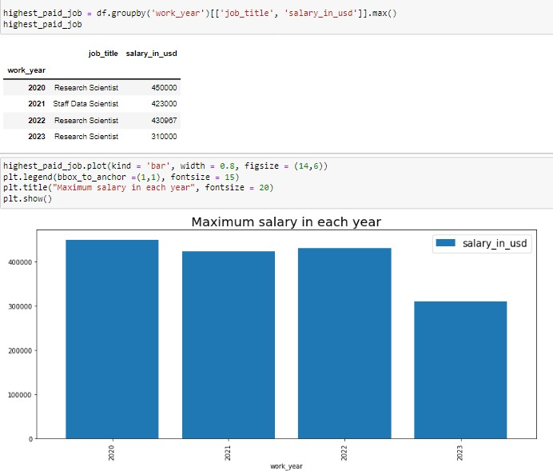
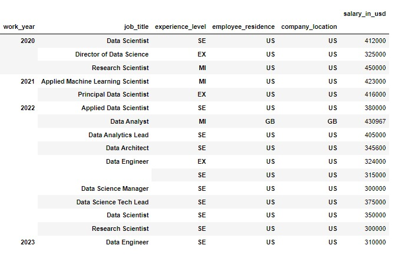
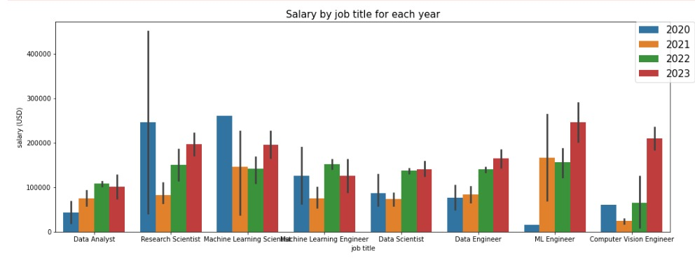
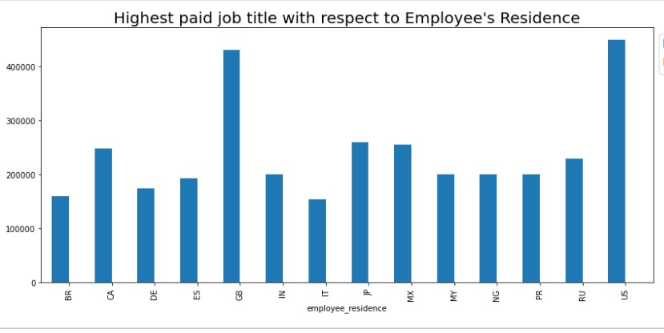
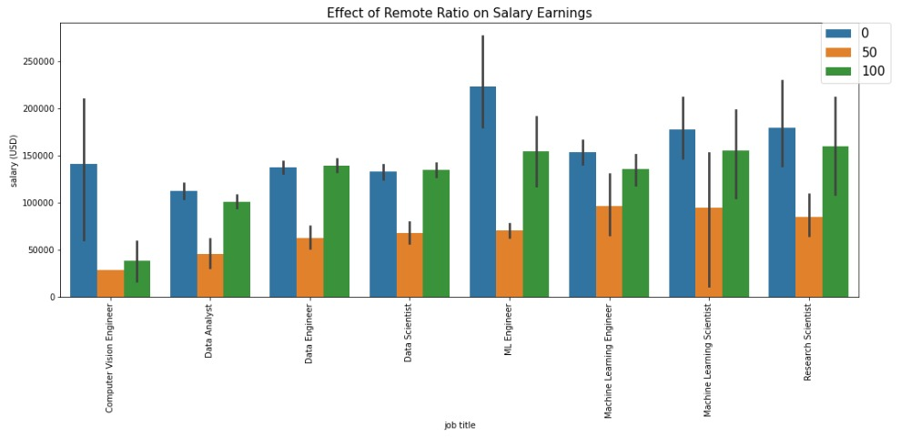
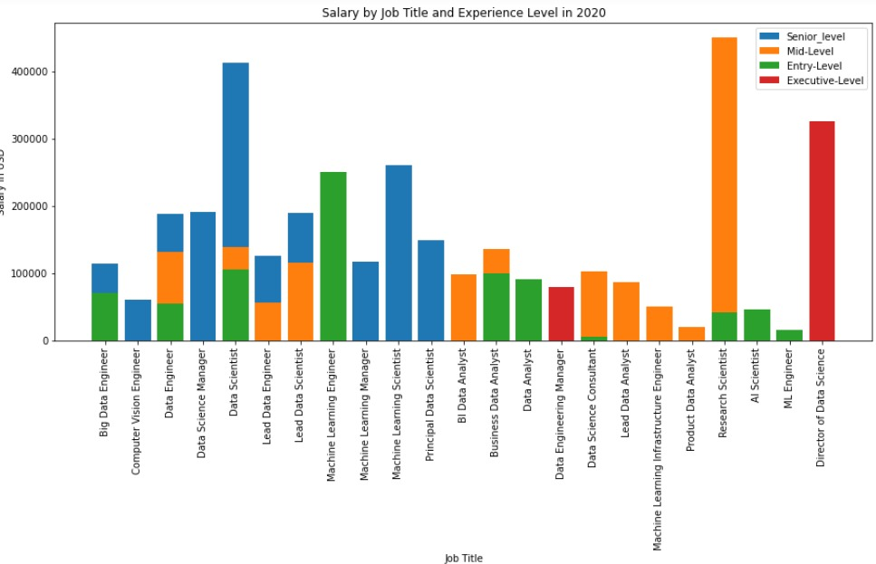
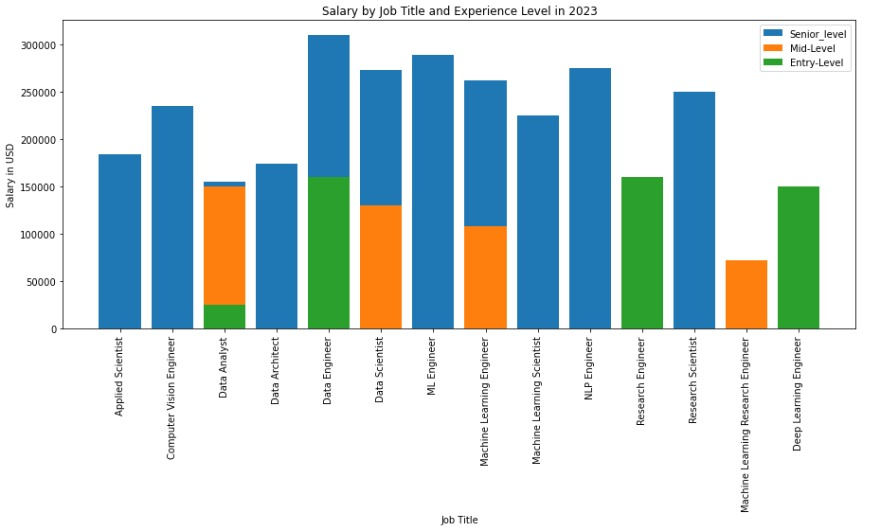

# SALARY

  

## Introduction
In the world of data, salaries are highly dependent on the individual's experience, job-title, skills, and location. The demand for data professionals has been increasing rapidly in recent years, leading to an upward trend in salaries. According to a survey by Glassdoor, the average base salary for a data analyst in the United States is around $67,000 per year, while a data scientist can expect to earn an average of $113,000 per year.
Data scientists, data analysts, and data engineers are some of the most sought-after roles in the industry, with salaries ranging from entry-level to six-figure salaries for experienced professionals. Without restrictions to only these three, other equivalent data roles are relevant and can land one in six-figure salaries. Companies across all industries are recognizing the value of data-driven decision-making, which is driving the demand for skilled professionals in this field. As data continues to grow in importance, so will the salaries for those who possess the necessary skills.This is why this PROJECT was carried out to give insight to newbies that wants to take up careers in the ddata space and also know how significant the upward trend in salaries of the data industry has grown in the past years.

**_Disclaimer_**: _All datasets and reports do not represent any company, institution or country, but just a dummy dataset to demonstrate capabilities in data visualization.

## Data Preparation and Processing

## Problem Statement
1. Find the highest paid job title. Also, with respect to experience level and employment type
2. Find out if the employee resience influences the chances of securing a job
3. Find out if remote ratio affects salary earnings of the employees
  a. Find out job titles listed for remote
  b. Find out if company location influences remote ratio
4. Find out the impact of Experience Level on salaries
5. Comparing paid part-time and full- time salary ratio

## Data Visualization

I filtered common jobs that appeared from 2020- 2023 based on the dataset checking their salary trend and the salary increment consistency over the years and found out that data analyst and data engineer gave the salary consistency. however, research scientist gave a consistent increase from 2021- 2023 after its fall in its high demand in 2020.

F
## Summary
- It showed that 2020, had the highest paying job salary than the consecutive years. Also salary range dropped after 2020. Research scientist got the rank for highest paid job for 2020. This is not suprising as reasons might have been due to the covid-19 pandemic when the world onsite job system almost shut down, giving more cognizance to hybrid and remote jobs pattern.

A research scientist is a professional who conducts scientific research to expand knowledge in their field and develop new technologies or products. The role typically involves designing and conducting experiments, analyzing data, and publishing research findings in scientific journals. which might have lead to them beign the most sought after due to the world crisis and as the saying goes. the hgher the demand for a particular skill or service, the more valuable it becomes. this is because as demand increases the supply of qualified individuals with those skills may not be able to keep up, resulting in a scarcity of talent. As a result, individuals with those in-demand skills can command higher salaries, better job opportunities, and greater job security. u gerrit(emoji).

## Conclusion
From the above analysis, it has been noted that the appetite for data jobs in the United States has been steadily increasing in recent years, as businesses across a range of industries recognizes the value of data-driven decision-making, causing a great demand of most data-related jobs. According to the Bureau of Labor Statistics, employment of computer and information research scientists (which includes many data-related roles) is projected to grow 15% from 2019 to 2029, which is much faster than the average for all occupations. In addition, the demand for **Data Analysts and Data Scientists** is particularly strong in industries such as Finance, Healthcare, and Technology. With the growing importance of data in today's business landscape, it is likely that the appetite for data-related jobs will continue to increase in the United States and around the world. However, Africa which has more under- developed countries need to imbibe these data expertise for significant economic growth.
Data world job roles are crucial for Africa's development because they provide valuable skills and expertise that can help drive economic growth and social progress. By leveraging **Data Analysis and Data Science skills**, African businesses and organizations can gain important insights into customer behavior, market trends, and operational efficiency, which can help them make more informed decisions and drive growth. In addition, data-driven approaches can also help to address critical social challenges such as healthcare, education, and poverty reduction, by providing insights into the needs of underserved populations and informing more effective policy interventions. By developing a strong workforce in data-related job roles, Africa can position itself to harness the power of data to drive development and improve quality of life for its citizens.

